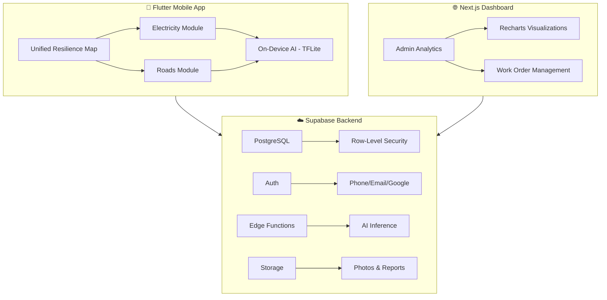

# 🇬🇭 InfraGuard AI – Ghana's Unified Infrastructure Intelligence Platform

> **100% FREE forever** for all Ghanaian users. Open-source (MIT License).


InfraGuard AI merges **electricity grid monitoring** (Dumsor AI) and **road condition intelligence** (Computer Vision AI) into a single, premium-quality platform purpose-built for Ghana's infrastructure challenges.

## 🏗 Architecture



## 📁 Project Structure

```
infraguard-ai/
├── mobile/              # Flutter 3.24+ (Android & iOS)
│   ├── lib/
│   │   ├── core/        # Theme, routing, constants
│   │   ├── features/    # Auth, Home, Electricity, Roads, Dashboard, Settings
│   │   └── shared/      # Widgets, models, services
│   └── pubspec.yaml
├── web/                 # Next.js 15 + Tailwind + shadcn/ui
│   ├── app/             # App Router pages
│   ├── components/      # UI components
│   └── package.json
├── backend/             # Supabase
│   └── supabase/
│       ├── schema.sql   # Database schema + RLS
│       └── seed.sql     # Sample Ghana data
├── ai/                  # ML notebooks
│   ├── road_detection_notebook.py
│   └── outage_prediction_notebook.py
├── docs/                # Documentation
│   ├── SCREENS.md       # UI component descriptions
│   └── DEPLOYMENT.md    # Store & hosting deployment
└── README.md
```

## 🚀 Quick Start

### Prerequisites
- Flutter 3.24+ & Dart SDK
- Node.js 18+ & npm
- Supabase CLI (optional for local dev)
- Git

### Mobile App
```bash
cd mobile
flutter pub get
flutter run          # Runs on connected device/emulator
```

### Web Dashboard
```bash
cd web
npm install
npm run dev          # Opens at http://localhost:3000
```

### Database Setup
1. Create a Supabase project at [supabase.com](https://supabase.com)
2. Run `backend/supabase/schema.sql` in the SQL Editor
3. Run `backend/supabase/seed.sql` to populate sample data
4. Copy your Supabase URL and anon key to:
   - `mobile/lib/core/constants/env.dart`
   - `web/.env.local`

## 🎨 Design System

| Token | Value | Usage |
|-------|-------|-------|
| Ghana Gold | `#FCD116` | Primary accent, CTAs |
| Ghana Green | `#006B3F` | Success, positive |
| Ghana Red | `#CE1126` | Alerts, critical |
| Ghana Black | `#000000` | Text, dark mode base |
| Surface Dark | `#0A0E1A` | Dark mode background |
| Surface Light | `#F8F9FC` | Light mode background |

## 👥 User Roles

1. **Citizen** – Report issues, view predictions, track repairs
2. **Field Technician** – Photo workflows, maintenance checklists
3. **ECG/Utility Engineer** – Grid analytics, outage management
4. **Municipal Officer** – Road priorities, work orders
5. **Industrial/SME** – Custom alerts, business impact view
6. **Admin** – Full government dashboard, user management

## 📱 Key Features

- **Unified Ghana Resilience Map** – Toggle power grid & road layers
- **Dumsor AI** – 24-72 hr outage predictions using ML
- **Road CV AI** – On-device pothole/crack detection from photos
- **Cross-Module Intelligence** – "Road flooding will damage power line Y in 48 hrs"
- **Offline-First** – Full functionality without internet
- **Voice Input** – Twi, Ga, Ewe, English support
- **Dark/Light Mode** – Optimized for night field work

## 🔐 Data & Privacy

Fully compliant with the **Ghana Data Protection Act (Act 843)**. All training data is anonymized. User data never leaves Supabase-managed infrastructure.

## 📄 License

MIT License – see [LICENSE](./LICENSE)

---

**Built with ❤️ for Ghana 🇬🇭**
